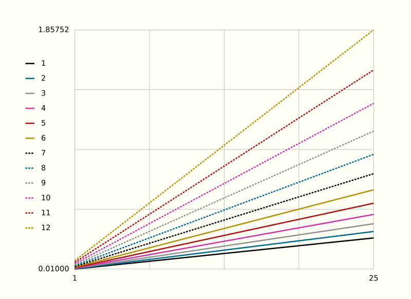
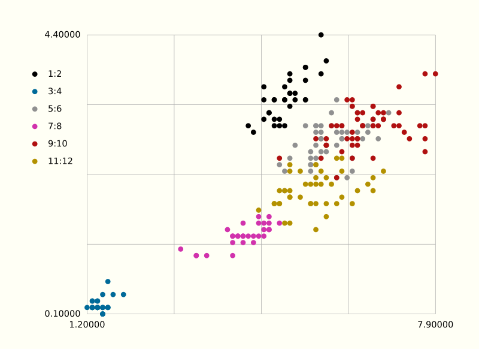

# bbv

Bbv (for "bare-bones viewer") is a minimalist, bare-minimum, data plotter for
the command line. It is best suited for a quick look at functional relations
gathered during exploratory data analysis.

Bbv uses stdin as input and must therefore be called from a pipe of shell
commands: `command_1 | command_2 | ... | bbv`.

The data must be tab-separated, and there is only one option, `x`.

Piping your data into `bbv` will produce a line plot column by column.
For example:



Piping your data into `bbb x` will produce a scatter plot of pairwise (x, y)
values. For example:


feedgnuplot

Bbv, being written in shell and awk, requires only a functioning POSIX system
and does not tie you to any extra toolchain. You can use any image viewer as
back end, provided it reads the SVG format. Possible candidates are:

- eom (Eye of MATE)
- feh
- imv
- loupe (GNOME Image Viewer)
- pqiv
- sxiv | nsxiv
- viewnior
- vimiv

All of these viewers open SVGs, permit image zooming (+/-), and allow you to use
keyboard arrows for paning. Some of these viewers also accept vim-like shortcuts
(h, j, k, l) for arrows.


# Installation

* Download the provided [bbv](bbv) file.

* Make the file executable (`chmod +x bbv`) and put it into your PATH.

* Specify your image back end via the environment variable, `BBV_BACKEND`.
For example, if you want to use `imv` as viewer, write the following:

```
export BBV_BACKEND='imv'
```

in your `.bashrc` or equivalent.


# Usage

Typing `bbv` directly in the terminal will print a short help on usage.

Otherwise, usage is from a pipe, `... | bbv [x]`.

The x and y ranges of the resulting plot are set from the minima and maxima
of your dataset. While plotting, bbv skips missing values and/or non-numeric
values.

It goes without saying that there are no options for titles, annotations, custom
axes, axis transformations, custom labels, ticks, styles, colors, plot types, etc.
Again, the only option ix `x`.


# Note on output

The file that `bbv` produces from stdin is saved in your working directory as
`tmp.svg`.  This is a regular SVG file, editable in Inkscape (for example).


# License

MIT

